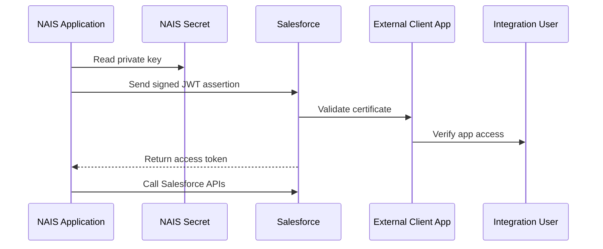

# External Client Apps Authentication

External Client Apps (ECA) with JWT Bearer authentication is the primary pattern for machine-to-machine communication from NAIS applications to Salesforce.

Applications authenticate using a signed JWT assertion generated from a private key stored as a NAIS secret. Salesforce validates the signature using a public certificate configured on the External Client App and returns an access token that can be used against Salesforce APIs.

JWT certificates are generated and managed using sf-keytool.

## Flow

## Usage

See the [sf-keytool GitHub repository](https://github.com/navikt/sf-keytool) for setup and certificate management details.
