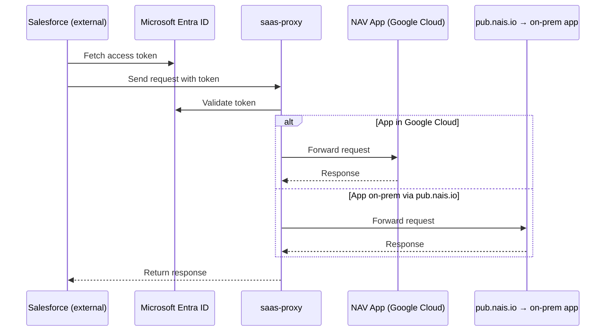

# Saas-proxy

Saas‑proxy is a secure API gateway that enables Salesforce to talk to internal NAIS-hosted services without exposing them publicly. It enforces Entra ID-based authentication and strict, configurable whitelisting of allowed API paths. Once requests are approved, the proxy routes them into NAV’s cloud infrastructure (via GCP or pub.nais.io), returning responses back to Salesforce.

## Flow

## Usage

See the [navikt/saas-proxy](https://github.com/navikt/saas-proxy) repository on GitHub for configuration instructions.